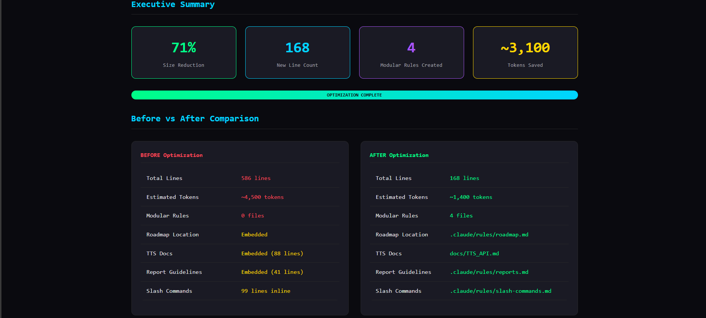

# Hi, I'm Arik 👋

I build AI-powered automation systems and developer tools.

## 🚀 Featured: CLAUDE.md Optimization Guide

I created a comprehensive guide for optimizing Claude Code's `CLAUDE.md` configuration file based on Anthropic's best practices.



### Results

```text
╔═══════════════════╦═══════════════════╦═══════════════════╦═══════════════════╗
║       71%         ║       168         ║        4          ║     ~3,100        ║
║   Size Reduction  ║   New Line Count  ║   Modular Rules   ║   Tokens Saved    ║
╚═══════════════════╩═══════════════════╩═══════════════════╩═══════════════════╝
```

| Metric           | Before       | After                        |
| ---------------- | ------------ | ---------------------------- |
| Total Lines      | 586 lines    | 168 lines                    |
| Estimated Tokens | ~4,500       | ~1,400                       |
| Modular Rules    | 0 files      | 4 files                      |

### 📚 Resources

| Resource | Description |
| -------- | ----------- |
| [Optimization Guide](https://github.com/Adkr1989/claude-agent-sdk-intro/blob/main/docs/CLAUDE_MD_OPTIMIZATION_GUIDE.md) | Step-by-step guide to reduce token usage |
| [Modular Rules Templates](https://github.com/Adkr1989/claude-agent-sdk-intro/tree/main/.claude/rules) | Reusable `.claude/rules/` examples |
| [Visual Report](https://github.com/Adkr1989/claude-agent-sdk-intro/blob/main/docs/ADEV_CLAUDE_MD_OPTIMIZATION_REPORT_2026-01-10.html) | Interactive before/after comparison |

### Key Takeaways

- Keep `CLAUDE.md` under **~200 lines** (~2,000 tokens)
- Use **`.claude/rules/`** for modular, topic-specific instructions
- Move documentation to **`docs/`**, not inline
- Use **`@path` imports** to reference external files

---

## 🛠️ What I Build

- **AI Agent Systems** - Claude Agent SDK, MCP integrations
- **Automation Workflows** - N8N, custom pipelines
- **Developer Tools** - CLI utilities, productivity enhancers

## 📫 Connect

- 💼 [LinkedIn](https://linkedin.com/in/your-profile)
- 🐦 [Twitter](https://twitter.com/your-handle)
- 🌐 [Website](https://your-website.com)

---

*Building with Claude Code* ✨